# Updated System Architecture Diagram

This diagram reflects the current microservices architecture of the Beginner Investor Hub platform. It provides a more detailed and accurate view than the original conceptual diagram, showing the separation of concerns between the frontend, a backend-for-frontend (BFF) API gateway, and specialized Python microservices.

```mermaid
graph TD
    subgraph "User Interaction"
        User["👤 User"]
    end

    subgraph "Platform: Vercel"
        Frontend["🚀 Frontend (Next.js)"]
    end

    subgraph "Platform: Render"
        Backend_API["🌐 Backend API Gateway (Node.js)"]
        
        subgraph "Python Microservices"
            direction LR
            Nudge_Engine["🧠 AI Nudge Engine"]
            Risk_Engine["⚖️ Risk Calculation Engine"]
            Market_Data_Engine["📈 Market Data Ingestion"]
        end

        subgraph "Data Stores"
            direction TB
            Database["🗄️ Database (PostgreSQL)"]
            Cache["⚡ Cache (Redis)"]
        end
    end

    subgraph "External Services"
        FirebaseAuth["🔥 Firebase Auth"]
        Financial_APIs["🏦 Financial Data APIs <br/>(Alpha Vantage, Polygon, etc.)"]
    end

    %% --- Connections ---

    %% User Flow
    User -- "Interacts with UI" --> Frontend
    
    %% Frontend to Backend/External
    Frontend -- "API Calls (GraphQL/REST)" --> Backend_API
    Frontend -- "Handles Auth Flow" --> FirebaseAuth
    
    %% Backend API Gateway Responsibilities
    Backend_API -- "Verifies JWT" --> FirebaseAuth
    Backend_API -- "Orchestrates & Routes Calls" --> Nudge_Engine
    Backend_API -- "Orchestrates & Routes Calls" --> Risk_Engine
    Backend_API -- "Reads/Writes User & Portfolio Data" --> Database
    Backend_API -- "Caches Aggregated Responses" --> Cache
    
    %% Python Microservices Responsibilities
    Nudge_Engine -- "Accesses User Behavior" --> Database
    Risk_Engine -- "Accesses Market & Portfolio Data" --> Database
    Market_Data_Engine -- "Fetches & Stores Data" --> Financial_APIs
    Market_Data_Engine -- "Writes Market Data" --> Database
```

